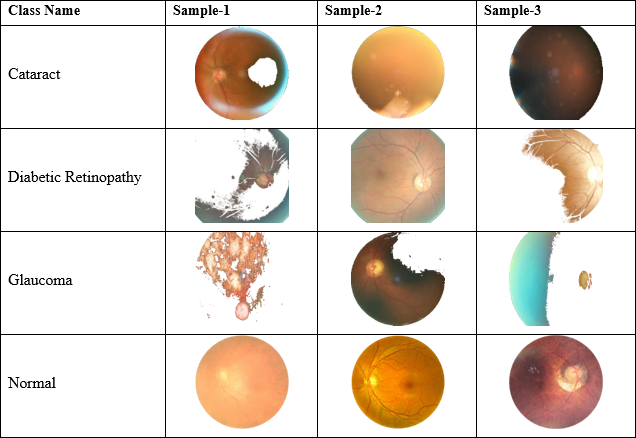

# EyeCNN

## Web-Server
This repo contains source coude for *EyeCNN* webserver, developed and deployed using Streamlit, which can be accessed on 

## How To use the Web-Server
1) Open the webserver using the above link.
2) Upload a picture of a disease in the file uploader.
3) You will get the predicted result in 1/2 seconds.

### Sample-Dataset

